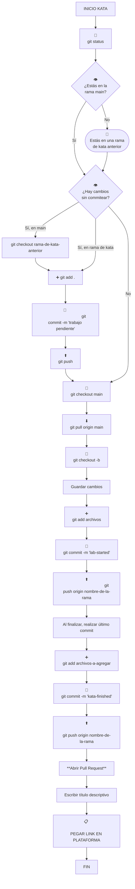

# Guía de Ayuda: Uso de Git en los Katas de Ironhack

## Diagrama general

**Para trabajar en una kata**, se debe seguir el siguiente flujo de trabajo: 

```mermaid
flowchart TD
    inicio[INICIO KATA] --> checkStatus[🚦 
                                       git status]
    
    %% Verificar si estamos en main
    checkStatus --> checkMain{👁️ 
                              ¿Estás en la 
                              rama main?}
    
    %% Chequeo de cambios en main o en una rama de kata
    checkMain -->|Sí| checkChanges{👁️ 
                                    ¿Hay cambios 
                                    sin commitear?}
    checkMain -->|No| checkKataBranch([🚨 
                                       Estás en una rama 
                                       de kata anterior])
    checkKataBranch --> checkChanges

    %% Opciones para cambios sin confirmar
    checkChanges -->|Sí, en main| switchToKataBranch[git checkout rama-de-kata-anterior]
    switchToKataBranch --> addChanges[➕ git add .]
    addChanges --> commitChanges[💾 
                                 git commit -m 'trabajo pendiente']
    commitChanges --> pushChanges[⬆️
                                  git push]
    pushChanges --> returnToMain[🔄 
                                 git checkout main]

    checkChanges -->|Sí, en rama de kata| addChanges
    checkChanges -->|No| returnToMain[🔄 
                                    git checkout main]

    %% Creación de nueva rama
    returnToMain --> pullMain[⬇ 
                              git pull origin main]
    pullMain --> checkoutNewBranch[🔄 
                                    git checkout -b <kata_nombre-mi_nombre>]

    %% Comandos en la nueva rama
    checkoutNewBranch --> saveChanges[Guardar cambios]
    saveChanges --> stageFiles[➕ 
                              git add archivos]
    stageFiles --> initialCommit[💾 
                                 git commit -m 'lab-started']
    initialCommit --> pushToBranch[⬆️
                                    git push origin nombre-de-la-rama]
   
    %% Finalización y PR
    pushToBranch --> finalCommit[Al finalizar, realizar último commit]
    finalCommit --> addFinalFiles[➕ 
                                    git add archivos-a-agregar]
    addFinalFiles --> finalCommitMessage[💾 
                                          git commit -m 'kata-finished']
    finalCommitMessage --> pushFinalChanges[⬆️
                                           git push origin nombre-de-la-rama]
    pushFinalChanges --> openPR[**Abrir Pull Request**]
    openPR --> prDescription[Escribir título descriptivo]
    prDescription --> reviewMerge[📋 
                                 PEGAR LINK EN PLATAFORMA]
    reviewMerge --> fin[FIN]

```

