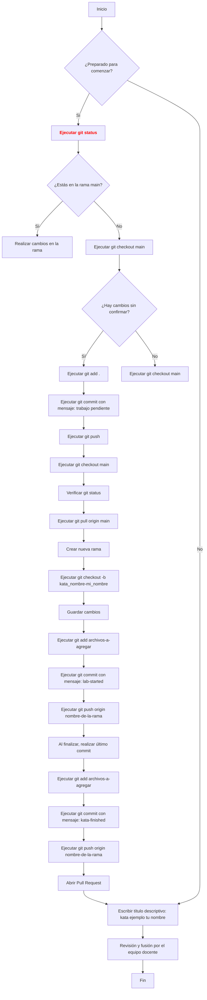

# Guía de Ayuda: Uso de Git en los Katas de Ironhack

## Índice
1. [Introducción](#introducción)
2. [Comprobación Inicial](#verificación-inicial)
3. [Creación de una Nueva Rama](#creación-de-una-nueva-rama)
4. [Comandos Básicos de Git](#comandos-básicos-de-git)
5. [Abrir un Pull Request](#abrir-un-pull-request)
6. [Conclusión](#conclusión)

---

## Introducción

Bienvenidos a la guía de uso de Git para los Katas de Ironhack. Esta guía está diseñada para que sigas un paso a paso claro y evites errores comunes. Asegúrate de seguir cada paso con atención.

---

## Comprobación Inicial

1.  **Antes de comenzar una nueva tarea** : Abre la terminal y ejecuta:

   ```
   git status
   ```

1.1  **Verifica si estás en la rama main** :

   - Si no estás en la rama `main`, cambia a la rama principal con:

   ```
   git checkout main
   ```

1.2  **Si estás en una rama local y tienes cambios sin confirmar** : Ejecuta los siguientes comandos para guardar tus cambios:

   ```
   git add .
   ```

   ```
   git commit -m "trabajo pendiente"
   ```

   ```
   git push
   ```
   ```
   git checkout main
   ```

1.3  **Verifica que ahora estés en la rama main** :

   ```
   git status
   ```

   Luego, asegúrate de que tu rama principal esté actualizada:

   ```
   git pull origin main
   ```

---

## Creación de una Nueva Rama

2. Una vez que estés en la carpeta del proyecto Katas, crea una nueva rama para comenzar una nueva tarea:

   ```
   git checkout -b <kata_nombre-mi_nombre>
   ```

   **Ejemplo:** `git checkout -b kata-vowel-count-victor`

---

## Comandos Básicos de Git

3. Guarda tus cambios regularmente utilizando:

   ```
   git add <archivos-a-agregar>
   ```

   ```
   git commit -m "lab-started"
   ```

   ```
   git push origin <nombre-de-la-rama>
   ```

   **Al finalizar, realiza un último commit de la siguiente manera:**

   ```
   git add <archivos-a-agregar>
   ```

   ```
   git commit -m "kata-finished"
   ```

   ```
   git push origin <nombre-de-la-rama>
   ```

---

## Abrir una Pull Request

4.  **Finalmente, abre una Pull Request** :

   - Ve a la interfaz del repositorio en GitHub y selecciona tu rama para hacer un Pull Request hacia `main`.

   - Escribe un título descriptivo como:

   ```
   kata ejemplo [tu nombre]
   ```

   El equipo docente revisará tu rama y realizará la fusión de la mejor.

---

## Conclusión

**Para trabajar en las tareas futuras**, crea una nueva rama para cada nueva tarea siguiendo el mismo procedimiento. 

### ¡Happy conding!


